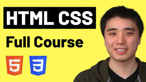

# Youtube Clone

## Project Link [Click to open Website](https://stackritesh.me/youtube-clone/) to see it Live.

I'm gonna add some of my basic practices with HTML & CSS and in the end I'll be making a Responsive Youtube Clone Webpage.

This is the tutorial I am following for practising. Click on the Image to Open the Tutorial Video !

# Details

[1st Exercise](https://github.com/git-ritesh/youtube-clone/tree/master/intro-to-html/Lesson%2001) => Anchor tag & Button tag.

[2nd Exercise](https://github.com/git-ritesh/youtube-clone/tree/master/intro-to-html/Lesson%2002) => Very basic styling to Buttons.

[3rd Exercise](https://github.com/git-ritesh/youtube-clone/tree/master/intro-to-html/Lesson%2003) => Used Transition, Hover & Shadow effect on Buttons.

[4th Exercise](https://github.com/git-ritesh/youtube-clone/tree/master/intro-to-html/Lesson%2004) => Learnt about CSS Box Model.

[5th Exercise](https://github.com/git-ritesh/youtube-clone/tree/master/intro-to-html/Lesson%2005) => Learnt about text styling, text elements like span, strong, etc.

[6th Exercise](https://github.com/git-ritesh/youtube-clone/tree/master/intro-to-html/Lesson%2006) => Learnt about the Structure of HTML, it's features & Benefits, Seperated all the styles from the HTML from previous Lessons and placed them into an External Stylesheet CSS file.

[7th Exercise](https://github.com/git-ritesh/youtube-clone/tree/master/intro-to-html/Lesson%2007) => Learnt about the Images and its styling. we also learnt about Search Box and its Properties.

[8th Exercise](https://github.com/git-ritesh/youtube-clone/tree/master/intro-to-html/Lesson%2008) => Learnt about the various types of HTML elements according to display properties like _block_, _inline-block_, _inline_.

[9th Exercise](https://github.com/git-ritesh/youtube-clone/tree/master/intro-to-html/Lesson%2009) => Learnt about the div elements & containers.

[10th Exercise](https://github.com/git-ritesh/youtube-clone/tree/master/intro-to-html/Lesson%2010) => Learnt about the Nested Layouts Technique.

[11th Exercise](https://github.com/git-ritesh/youtube-clone/tree/master/intro-to-html/Lesson%2011) => Learnt about the Grid Layout & its properties.

[12th Exercise](https://github.com/git-ritesh/youtube-clone/tree/master/intro-to-html/Lesson%2012) => Learnt about the Flexbox & its properties.

[13th Exercise](https://github.com/git-ritesh/youtube-clone/tree/master/intro-to-html/Lesson%2013) => Learnt about the Nested Flexbox.

[14th Exercise](https://github.com/git-ritesh/youtube-clone/tree/master/intro-to-html/Lesson%2014) => Learnt about the CSS Position fixed & its properties & use in making sidebars and navbars.

[15th Exercise](https://github.com/git-ritesh/youtube-clone/tree/master/intro-to-html/Lesson%2015) => Learnt about the Position Absolute & Relative Concepts.

[16th Exercise](https://github.com/git-ritesh/youtube-clone/tree/master/intro-to-html/Lesson%2016) => Finished the YouTube Clone. 

[17th Exercise](https://github.com/git-ritesh/youtube-clone/tree/master/intro-to-html/Lesson%2017) => Learnt about some more CSS Features. 
